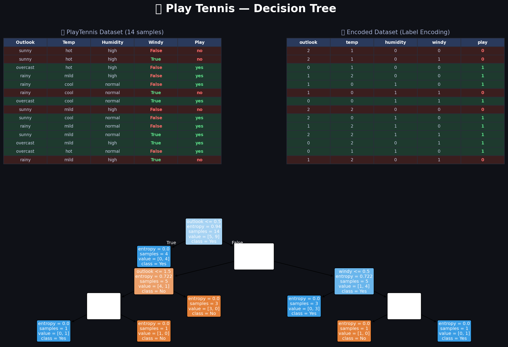

 Play Tennis Classification using Decision Tree

A machine learning project that uses the Decision Tree algorithm to predict whether a tennis game should be played based on weather conditions.

📌 Overview

The Play Tennis Decision Tree project is a classic machine learning example used to demonstrate how classification algorithms work.

It analyzes weather conditions such as:

Outlook 🌤️

Temperature 🌡️

Humidity 💧

Wind 🌬️

And predicts whether to:

👉 Play Tennis or Not

## 🖼️ Decision Tree Visualization

*The above diagram illustrates how the decision tree works: asking a sequence of weather conditions to decide whether to play tennis or not.*

This project demonstrates your understanding of:

🤖 Supervised Machine Learning

🌳 Decision Tree algorithm

📊 Data preprocessing

🧠 Feature selection using entropy & information gain

Decision trees work by asking a sequence of questions, where each node represents a condition and each branch represents an outcome, until a final decision is reached.

✨ Features

🌳 Build a Decision Tree model

📊 Analyze categorical dataset

🔍 Use entropy & information gain

🤖 Predict outcomes (Yes / No)

📈 Understand model logic visually

🛠️ Tech Stack

Python

Scikit-learn / Custom Implementation

Pandas

NumPy

📂 Project Structure
.
├── data/              # Play Tennis dataset
├── notebook.ipynb     # Model building & analysis
├── model/             # Trained model (if saved)
├── play_tennis_DT Screen.png  # Decision tree diagram
└── README.md

🚀 Getting Started

Prerequisites

Python 3.x

Jupyter Notebook (optional)

Installation

git clone https://github.com/AliSayed15/play_tennis-with-DT.git

cd play_tennis-with-DT

pip install -r requirements.txt

jupyter notebook

🎯 How It Works

Load the dataset (weather conditions)

Encode categorical features

Calculate entropy & information gain

Build the Decision Tree

Train the model

Predict whether to play tennis

📊 Dataset Example

| Outlook     | Temperature | Humidity | Wind   | Play |
|-------------|-------------|----------|--------|------|
| Sunny       | Hot         | High     | Weak   | No   |
| Overcast    | Hot         | High     | Weak   | Yes  |
| Rain        | Mild        | High     | Weak   | Yes  |

👉 الهدف: التنبؤ هل نلعب ولا لأ بناءً على الطقس

📈 Future Improvements

Visualize the decision tree 🌳

Compare with other algorithms (KNN, SVM)

Hyperparameter tuning 🔧

Build simple UI or web app 🌐

Deploy the model 🚀

👨‍💻 Author

Ali El Sayed

🔗 LinkedIn: https://www.linkedin.com/in/ali-elsayed-1a51a7216/

💻 GitHub: https://github.com/AliSayed15

🤝 Contributing

Contributions are welcome!

Feel free to fork the repository and submit a pull request.

📄 License

This project is open-source and available under the MIT License.
